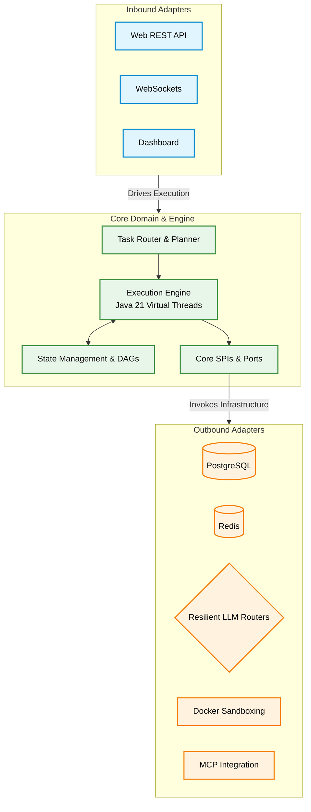

# Spring Boot Agentic Orchestrator

[](LICENSE)

---

## 1. Executive Summary

This application is an enterprise-grade agentic orchestration platform built using Spring Boot and Spring AI. It translates natural language user goals into structured, parallel-scheduled execution steps using Java 21 Virtual Threads, dynamic directed acyclic graphs (DAGs), and transactional state management. The framework is designed for secure, auditable, and resilient automation, featuring Docker-based container sandboxing, data loss prevention (DLP) filters, and Human-in-the-Loop (HITL) approval workflows.

---

## 2. System Architecture & Tech Stack

The application strictly implements the **Ports and Adapters (Hexagonal) Architecture** pattern, enforcing a complete separation of core business concerns from external system dependencies. The core domain layer (`core/domain` and `core/engine`) governs the agent loops, plans, and execution states. Core SPIs (Ports) are declared in `core/spi`, while all database, LLM client, container, and API integrations are relegated to the infrastructure layer (`adapters/`).



### Technology Stack

| Tech Category | Technology Used |
| --- | --- |
| **Language** | Java 21 |
| **Core Framework** | Spring Boot v4.0.6, Spring AI v2.0.0-M8 |
| **Persistence (Relational)**| PostgreSQL 16 (Runtime), JPA / Hibernate, H2 (Testing) |
| **State Caching & Memory** | Redis Cloud Agent Chat Memory |
| **Build System** | Maven |
| **Resilience & Fault Tolerance** | Resilience4j (Retry, Exponential Backoff, Failover) |
| **Isolation & Sandboxing** | Docker (Docker Java API Transport), Squid Proxy |
| **Observability** | OpenTelemetry, Prometheus, Grafana, Langfuse Tracing |
| **API Documentation** | Springdoc OpenAPI (v3.0.2) |

---

## 3. Core Domain & Features

### Orchestration & Execution

*   **Dynamic Task Routing**: The `TaskRouter` inspects incoming goals and classifies them as `SIMPLE` (serviced directly via a single LLM call) or `COMPLEX` (delegated to the full execution engine) to optimize resource consumption and latency. Reasoning model `<think>` tags are automatically stripped from classification output.
*   **Parallel DAG Step Execution**: The `Planner` generates multi-step execution plans modeled as directed acyclic graphs (DAGs) with explicit `dependsOn` dependencies. The `ExecutionEngine` resolves ready steps and concurrently dispatches them on Java 21 Virtual Threads (`Executors.newVirtualThreadPerTaskExecutor()`).
*   **Transactional Rollback (Memento Pattern)**: Before each parallel batch, the engine snapshots the entire `AgentContext` state (plan, observations, step summaries, action/replan counters) onto an internal memento stack. A soft execution failure triggers a full state rollback followed by a cognitive replan to recover.
*   **Batch Transaction Coordinator (Poison-Pill Pattern)**: The `BatchTransactionCoordinator` tracks health across parallel sibling steps using an `AtomicReference<BatchState>`. If any step throws a fatal exception, it atomically transitions to `INVALIDATED` and cancels all in-flight `Future` instances, preventing corrupted convergent writes.
*   **Self-Correcting Evaluator Loop**: After all plan steps complete, the `AgentEvaluator` invokes a dedicated LLM judge (routed to a separate `project-c` provider pool) that scores the output on `alignmentScore` and `safetyScore` (0.0–1.0). If `selfCorrectionEnabled` is true and the goal is not met (score < 0.8), the engine injects a critique observation and triggers an automatic recovery replan — creating a closed-loop self-correction cycle.
*   **Configurable Guardrail Engine**: All execution limits are externalized via `LlmProperties.GuardrailProperties` and loaded from `application.yml`. Configurable parameters include `maxActions` (20), `maxReplans` (5), `stagnationThreshold` (3), `maxTokenBudget` (100,000), and `maxObservationTokens` (2,000). Custom guardrail rules are loaded from `guardrails.yml` and injected into the evaluator's judging prompt.
*   **Stagnation Detection**: Within each step's reasoning loop, the engine tracks action hashes. If the last `N` actions (configurable threshold) produce identical hashes, a `STAGNATION_ERROR` observation is injected and a replan is forced to break infinite loops.

### LLM Abstraction & Resilience

*   **4-Layer LLM Abstraction**: The system implements a clean abstraction stack decoupled via interfaces and composition:
    1.  **`LlmProvider` (SPI Port)** — A core interface declaring `structuredRequest()` and `think()` contracts. The domain layer depends only on this interface.
    2.  **`SpringAiLlmProvider` (Adapter)** — Implements the port, handling JSON extraction, `<think>` tag stripping, structured output parsing with retry, and reasoning model output normalization.
    3.  **`ResilientLlmRouter` (Router)** — Implements `LlmRouter`, iterating through provider tiers filtered by `TaskType` (PLANNER, REASONER, JUDGE) and wrapping each call in Resilience4j retry decorators.
    4.  **`LlmProviderRegistry` (Registry)** — Lazily materializes `OpenAiChatModel` clients per provider ID with configurable base URLs, API keys, and timeouts.
*   **Multi-Tier Model Failover with Exponential Backoff**: Each LLM call is wrapped in a Resilience4j `Retry` with 3 max attempts and exponential backoff (2s base, multiplier 2×). On exhaustion of a provider tier (e.g., `project-a-level-1`), the router cascades to the next tier (level-2, level-3, level-4) before falling back to a global OpenRouter endpoint — achieving N-deep failover across 13 configured provider entries.
*   **Task-Aware Provider Routing**: The `ResilientLlmRouter` filters the provider pool based on the `TaskType` enum. Planning tasks use `project-a` providers, reasoning tasks use `project-b`, and judging tasks are isolated to `project-c` — preventing cross-contamination of rate limits and model selection.
*   **Per-Model Cost Tracking**: Every LLM response is instrumented with token usage metrics. The router resolves per-model pricing from a configurable `pricing` map (input/output cost per million tokens) and increments Micrometer counters (`llm.cost.usd`, `llm.tokens.input`, `llm.tokens.output`, `llm.latency`) tagged by model name and task type.
*   **Streaming-with-Fallback**: The router first attempts a streaming `Flux<ChatResponse>` call with a 90-second timeout and aggregates chunks. If streaming deserialization fails (e.g., `OpenAIInvalidDataException`), it automatically falls back to a synchronous blocking `call()`.
*   **Robust JSON Extraction**: The `SpringAiLlmProvider` implements a multi-strategy JSON extraction pipeline: strip `<think>` tags → remove markdown code fences → find all valid JSON candidates via brace-matching with string-escape awareness → validate each candidate against Jackson's `ObjectMapper` → select the longest valid block. This handles LLMs that wrap JSON in commentary, code blocks, or reasoning tags.

### Token & Context Management

*   **Hybrid Binary-Search Token Truncator**: The `HybridJTokkitTruncator` uses the JTokkit BPE tokenizer (CL100K_BASE encoding) to precisely truncate large tool observations. It splits the token budget 50/50 between head and tail segments, uses a binary search algorithm with surrogate-pair-safe boundaries to find the optimal cut points, and injects a structured `[SYSTEM WARNING]` banner in the middle indicating how many characters were removed.
*   **Context Window Manager**: The `ContextManager` truncates message lists to fit within each provider's `maxContextWindow`. It preserves the system message (index 0) and the last 2 messages, pruning from the middle with a 10% safety buffer. Token counting uses JTokkit with a per-message overhead of 4 tokens.

### Tool System

*   **Composite Tool Executor Chain**: The `CompositeToolExecutor` implements the `ToolExecutor` SPI using the Composite pattern. It aggregates multiple executor implementations (`CoreToolExecutor`, `McpToolExecutor`, `RedisMemoryToolExecutor`) and routes each tool call to the first executor that `supports()` it — with self-exclusion to prevent infinite recursion.
*   **Dynamic Tool Registry with Runtime Schema Generation**: The `JacksonToolRegistry` implements `ToolRegistry` and stores tool definitions with metadata flags (`isMutating`, `requiresApproval`, `SandboxProfile`). For Java record-based parameter classes, it generates JSON schemas at runtime using Spring AI's `JsonSchemaGenerator`. For MCP-sourced tools, it accepts pre-serialized JSON schemas directly.
*   **Custom Built-In Tools**: The `CoreToolExecutor` registers and executes a suite of built-in tools with typed parameter records annotated with `@JsonPropertyDescription`: `search_database`, `calculate_metrics`, `write_database`, `search_archive`, `web_search`, `list_system_resources`, `manage_system_resource`, and `get_system_health`.
*   **MCP Tool Auto-Discovery**: The `McpToolProvider` listens for `ApplicationReadyEvent` and introspects all `McpSyncClient` beans in the Spring context. It automatically registers every discovered MCP tool into the `ToolRegistry` with heuristic-based metadata classification (fetch vs. mutating) derived from tool name patterns.
*   **Redis Long-Term Memory Tools**: The `RedisMemoryToolExecutor` exposes `save_memory` and `search_memory` tools that persist and query agent facts against a Redis Cloud vector store via a REST client, giving the agent persistent long-term memory across sessions.

### Mock/Static System for Integration Testing

*   **Static Mock API Layer**: The `MockRestController` exposes a self-contained REST API (`/api/health`, `/api/resources`, `/api/action`) with in-memory state backed by `CopyOnWriteArrayList`. It simulates an external system with CRUD operations on mock resources (e.g., `Task-Processor`, `Database-Sync`, `Notification-Service`). This enables end-to-end agent testing without external dependencies — the agent can discover, query, and mutate these resources through its tool system, validating the full orchestration pipeline against a deterministic backend.

### Security & Isolation

*   **Human-in-the-Loop (HITL) Gates**: Automatically suspends execution state (`AWAITING_APPROVAL`) when a tool flagged as mutating or high-risk is triggered, enabling users to approve, reject, or provide feedback with modified arguments. The `ResumeRequest` validates decisions against an allowlist (`APPROVED`, `REJECTED`, `FEEDBACK`).
*   **CAS-Based Double-Click Prevention**: The `claimSuspendedRun()` method on `JpaMemoryStore` uses a synchronized Compare-And-Swap (CAS) pattern to atomically transition a run from `AWAITING_APPROVAL` to `RUNNING`, preventing race conditions from concurrent resume requests.
*   **Data Loss Prevention (DLP)**: The `DefaultSecretRedactor` collects all configured API keys at startup (from `LlmProperties` providers and OpenAI config) and scans every tool argument payload before dispatch. If any known secret value is found in the arguments, execution is blocked with a `SecurityException`.
*   **Sandbox Container Pooling**: The `McpContainerFactory` manages a warm pool of pre-created Docker containers per `SandboxProfile` (COMPUTE and FETCH). It implements a three-phase leasing strategy: (1) poll the warm queue for 500ms, (2) burst a cold ephemeral container if under `maxPoolSize`, (3) block up to 10s for a returning container. Returned containers are reset (workspace wiped) and re-enqueued; failed resets trigger self-healing replacement.
*   **Hardened Container Configuration**: COMPUTE containers run with `networkMode=none`, read-only root filesystem, a 64MB tmpfs at `/workspace` with `noexec,nosuid` flags, 256MB memory cap, and 50% CPU quota. FETCH containers run on the `sandbox_net` bridge with all Linux capabilities dropped (`CAP_DROP ALL`) and internet access routed exclusively through the Squid HTTP proxy.

### Observability & Monitoring

*   **End-to-End OpenTelemetry Tracing**: Every agent run, step execution, and tool invocation is wrapped in an OTel span with structured attributes (`threadId`, `runId`, `stepId`, `tool.name`, `tool.args`). Resume operations reconstruct the parent span context to maintain a single distributed trace across suspend/resume boundaries.
*   **Real-Time WebSocket Progress**: The `McpProgressWebSocketHandler` broadcasts tool execution progress to connected UI clients over a persistent WebSocket channel, enabling live dashboard updates without polling.
*   **Prometheus Metrics Export**: Actuator exposes `/actuator/prometheus` with counters for LLM cost (USD), input/output tokens, total tokens, and latency timers — all tagged by model name and task type. A pre-configured Grafana instance auto-provisions dashboards from the `sandbox/grafana/provisioning` directory.

---

## 4. Prerequisites

To compile, test, and run this application locally, ensure you have the following installed:
*   **Java**: JDK 21 (Temurin or equivalent distribution recommended)
*   **Build Tool**: Maven 3.9+ (or use the packaged `./mvnw` script)
*   **Containerization**: Docker and Docker Compose v2+
*   **Docker Socket Access**: Local user must have read/write access to `/var/run/docker.sock` to enable programmatically leased sandboxes.

---

## 5. Local Development Setup

### Step 1: Clone the Repository
```bash
git clone https://github.com/Janus-Aurelius/springAI-CapstoneProject1.git
cd springaiagent
```

### Step 2: Configure Environment Settings
Copy the example environment file and populate it with your API keys:
```bash
cp ..env.example ..env
```
Ensure you update the following parameters inside `.env`:
*   `GEMINI_PROJECT_A_API_KEY`, `GEMINI_PROJECT_B_API_KEY`, `GEMINI_PROJECT_C_API_KEY`: API keys for your AI model endpoints.
*   `GITHUB_PERSONAL_ACCESS_TOKEN`: Required for GitHub MCP features.
*   `TAVILY_API_KEY`: Required for web crawls and searches.
*   `LANGFUSE_PUBLIC_KEY`, `LANGFUSE_SECRET_KEY`, `LANGFUSE_HOST`: For trace recording.

### Step 3: Launch Supporting Infrastructure
Bring up PostgreSQL, Redis, MCP client adapters, Squid proxy, Prometheus, and Grafana:
```bash
docker-compose up -d --build
```

### Step 4: Verify Docker Services
Ensure all backing containers are healthy:
```bash
docker ps
```

### Step 5: Start the Spring Boot Application
Run the boot application locally using the Maven wrapper:
```bash
./mvnw spring-boot:run
```
The application will start, listen on port `8080`, and verify connections to backing MCP sidecars and databases.

---

## 6. API Documentation

The application exposes interactive REST documentation using **OpenAPI/Swagger**. 

Once the Spring Boot server is running locally:
*   Access the **Swagger UI**: [http://localhost:8080/swagger-ui/index.html](http://localhost:8080/swagger-ui/index.html)
*   Access raw JSON **API Specs**: [http://localhost:8080/v3/api-docs](http://localhost:8080/v3/api-docs)

---

## 7. Testing

The codebase includes standard unit and integration tests covering cognitive routing, resilient LLM routing, sandbox environments, and security DLP filters.

To run the complete test suite:
```bash
./mvnw test
```

For executing integration-specific profiles:
```bash
./mvnw test -P integration
```

---

## 8. Contact

For architectural queries, support, or code reviews, please visit:
*   **Portfolio**: [https://github.com/Janus-Aurelius](https://github.com/Janus-Aurelius)

### Project Team

| Name | Email | Role |
| :--- | :--- | :--- |
| Nguyen Thien An | 23520020@gm.uit.edu.vn  | Team Lead |
| Ha Nhat Minh | 23520922@gm.uit.edu.vn  | Team Member |
