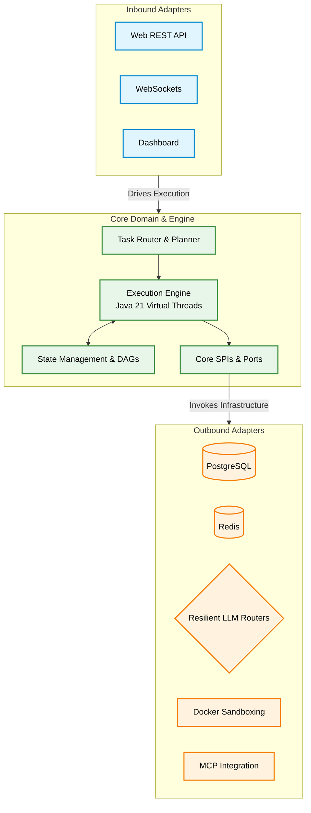

# Spring Boot Agentic Orchestrator

[](https://github.com/Janus-Aurelius/springAI-CapstoneProject1/actions)
[](https://codecov.io)
[](https://spring.io/projects/spring-boot)
[](LICENSE)

---

## 1. Executive Summary

This application is an enterprise-grade agentic orchestration platform built using Spring Boot and Spring AI. It translates natural language user goals into structured, parallel-scheduled execution steps using Java 21 Virtual Threads, dynamic directed acyclic graphs (DAGs), and transactional state management. The framework is designed for secure, auditable, and resilient automation, featuring Docker-based container sandboxing, data loss prevention (DLP) filters, and Human-in-the-Loop (HITL) approval workflows.

---

## 2. System Architecture & Tech Stack

The application strictly implements the **Ports and Adapters (Hexagonal) Architecture** pattern, enforcing a complete separation of core business concerns from external system dependencies. The core domain layer (`core/domain` and `core/engine`) governs the agent loops, plans, and execution states. Core SPIs (Ports) are declared in `core/spi`, while all database, LLM client, container, and API integrations are relegated to the infrastructure layer (`adapters/`).



### Technology Stack

| Tech Category | Technology Used |
| --- | --- |
| **Language** | Java 21 |
| **Core Framework** | Spring Boot v4.0.6, Spring AI v2.0.0-M8 |
| **Persistence (Relational)**| PostgreSQL 16 (Runtime), JPA / Hibernate, H2 (Testing) |
| **State Caching & Memory** | Redis Cloud Agent Chat Memory |
| **Build System** | Maven |
| **Resilience & Fault Tolerance** | Resilience4j (Retry, Exponential Backoff, Failover) |
| **Isolation & Sandboxing** | Docker (Docker Java API Transport), Squid Proxy |
| **Observability** | OpenTelemetry, Prometheus, Grafana, Langfuse Tracing |
| **API Documentation** | Springdoc OpenAPI (v3.0.2) |

---

## 3. Core Domain & Features

*   **Dynamic Task Routing**: Inspects incoming goals and classifies them as `SIMPLE` (serviced directly via the LLM) or `COMPLEX` (delegated to the execution engine) to optimize resource consumption.
*   **Parallel Step Execution**: Generates multi-step execution plans modeled as dependency graphs (DAGs) and concurrently executes runnable steps using a virtual thread-per-task executor.
*   **Transactional Rollback (Memento Pattern)**: Retains in-memory snapshots of the agent's context. A soft execution failure triggers a database-backed state rollback and a cognitive replan to bypass errors.
*   **Model Context Protocol (MCP) Client**: Dynamically queries and interacts with standalone MCP servers hosting PostgreSQL connectors, GitHub integrations, Puppeteer browsers, and Tavily search engines.
*   **Human-in-the-Loop (HITL) Gates**: Automatically suspends execution state (`AWAITING_APPROVAL`) when a tool flagged as mutating or high-risk is triggered, enabling users to approve, reject, or provide feedback/modified arguments.
*   **Data Loss Prevention (DLP)**: Features a central interceptor proxy (`SecretRedactor`) that validates tool inputs and blocks execution before credentials, secrets, or api keys leak downstream.
*   **Secure Code Sandboxing**: Evaluates scripts and network actions inside temporary, isolated Docker containers governed by custom Squid proxy configuration to prevent server compromise.
*   **Live Metrics & OpenTelemetry**: Instruments execution loops, tracking token budgets, costs, and timings, streaming progress over WebSockets, and piping trace records to Langfuse.

---

## 4. Prerequisites

To compile, test, and run this application locally, ensure you have the following installed:
*   **Java**: JDK 21 (Temurin or equivalent distribution recommended)
*   **Build Tool**: Maven 3.9+ (or use the packaged `./mvnw` script)
*   **Containerization**: Docker and Docker Compose v2+
*   **Docker Socket Access**: Local user must have read/write access to `/var/run/docker.sock` to enable programmatically leased sandboxes.

---

## 5. Local Development Setup

### Step 1: Clone the Repository
```bash
git clone https://github.com/Janus-Aurelius/springAI-CapstoneProject1.git
cd springaiagent
```

### Step 2: Configure Environment Settings
Copy the example environment file and populate it with your API keys:
```bash
cp ..env.example ..env
```
Ensure you update the following parameters inside `.env`:
*   `GEMINI_PROJECT_A_API_KEY`, `GEMINI_PROJECT_B_API_KEY`, `GEMINI_PROJECT_C_API_KEY`: API keys for your AI model endpoints.
*   `GITHUB_PERSONAL_ACCESS_TOKEN`: Required for GitHub MCP features.
*   `TAVILY_API_KEY`: Required for web crawls and searches.
*   `LANGFUSE_PUBLIC_KEY`, `LANGFUSE_SECRET_KEY`, `LANGFUSE_HOST`: For trace recording.

### Step 3: Launch Supporting Infrastructure
Bring up PostgreSQL, Redis, MCP client adapters, Squid proxy, Prometheus, and Grafana:
```bash
docker-compose up -d --build
```

### Step 4: Verify Docker Services
Ensure all backing containers are healthy:
```bash
docker ps
```

### Step 5: Start the Spring Boot Application
Run the boot application locally using the Maven wrapper:
```bash
./mvnw spring-boot:run
```
The application will start, listen on port `8080`, and verify connections to backing MCP sidecars and databases.

---

## 6. API Documentation

The application exposes interactive REST documentation using **OpenAPI/Swagger**. 

Once the Spring Boot server is running locally:
*   Access the **Swagger UI**: [http://localhost:8080/swagger-ui/index.html](http://localhost:8080/swagger-ui/index.html)
*   Access raw JSON **API Specs**: [http://localhost:8080/v3/api-docs](http://localhost:8080/v3/api-docs)

---

## 7. Testing

The codebase includes standard unit and integration tests covering cognitive routing, resilient LLM routing, sandbox environments, and security DLP filters.

To run the complete test suite:
```bash
./mvnw test
```

For executing integration-specific profiles:
```bash
./mvnw test -P integration
```

---

## 8. Contact

For architectural queries, support, or code reviews, please visit:
*   **Portfolio**: [https://github.com/Janus-Aurelius/springAI-CapstoneProject1](https://github.com/Janus-Aurelius/springAI-CapstoneProject1)

### Project Team

| Name | Email | Role |
| :--- | :--- | :--- |
| Nguyen Thien An | 23520020@gm.uit.edu.vn  | Team Lead |
| Ha Nhat Minh | 23520922@gm.uit.edu.vn  | Team Member |
